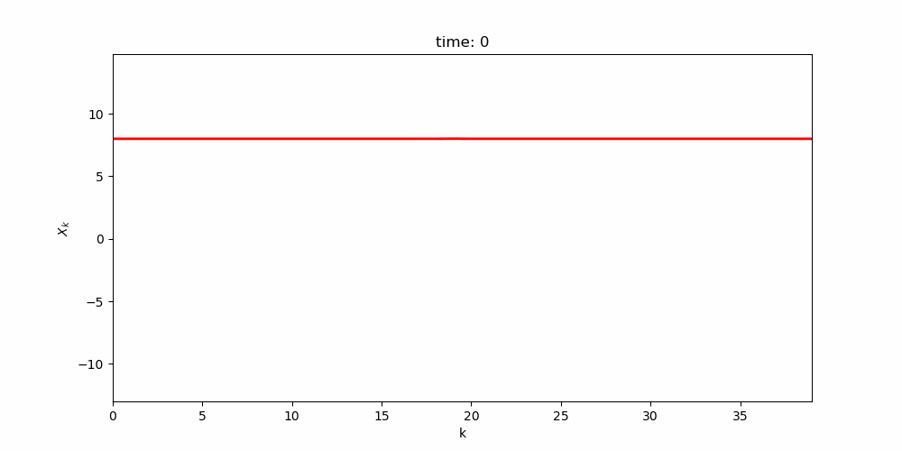
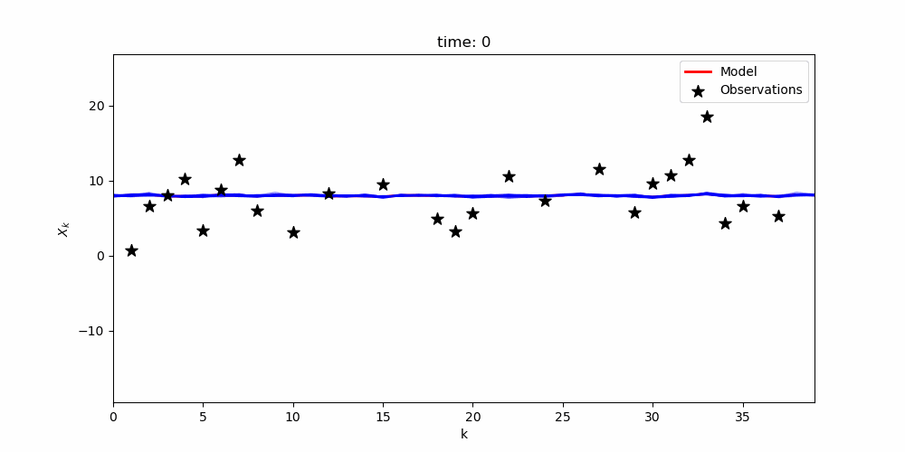

# Data Assimilation with Lorenz 96

## Overview
In this project we are performing data assimilation to the 1-dimensional form of the Lorenz 96 system:

$$
\frac{d X_j}  {d t}=\left(X_{j+1}-X_{j-2}\right) X_{j-1}-X_j+F
$$

To go from this:

    

To this:

    

