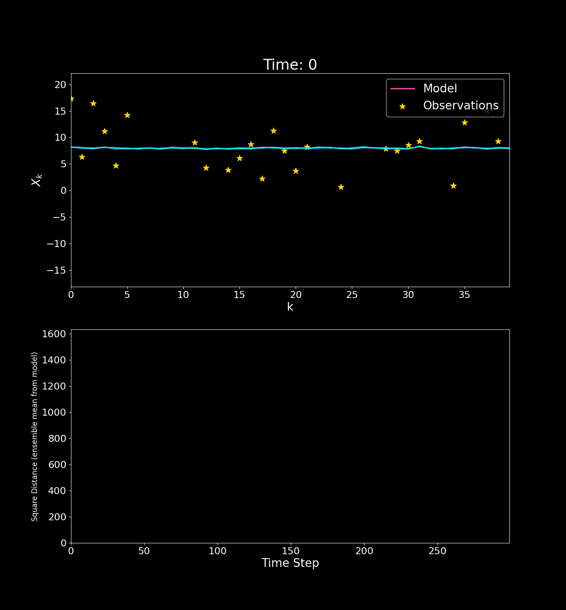

# Data Assimilation with Lorenz 96

## Overview
In this project we are performing data assimilation to the 1-dimensional form of the Lorenz 96[^1] system:

$$
\frac{d X_j}  {d t}=\left(X_{j+1}-X_{j-2}\right) X_{j-1}-X_j+F
$$

Which is our chaotic model:

<p align="center">
    
</p>

And by simulating observations with errors (black stars), we use Ensemble Kalman Filter (EnKF) methods[^2] to make predictions (blue lines):

<p align="center">
    
</p>

**Note:** We will do better than this with some tweaks[^3], but you'll have to look at the project to find out how.

## How to Explore 

### Option 1

Clone the repo and explore the Jupyter notebooks in the notebooks folder.

### Option 2
If you want a fancy Streamlit app that enables you to easily configure the number of ensembles and inflation factor and produce animation like this:

<p align="center">
    
</p>

Then clone the repo, open your terminal, navigate to the directory of the repo and execute:
```console
pip install -r requirements.txt
```
And then:
```console
streamlit run streamlit_app.py
```


## References

[^1]: Lorenz, Edward N. "Predictability: A problem partly solved." Proc. Seminar on predictability. Vol. 1. No. 1. 1996.

[^2]: Evensen, Geir. "The ensemble Kalman filter for combined state and parameter estimation." IEEE Control Systems Magazine 29.3 (2009): 83-104. [https://doi.org/10.1109/MCS.2009.932223](https://doi.org/10.1109/MCS.2009.932223)

[^3]: Raanes, Patrick N., Marc Bocquet, and Alberto Carrassi. "Adaptive covariance inflation in the ensemble Kalman filter by Gaussian scale mixtures." Quarterly Journal of the Royal Meteorological Society 145.718 (2019): 53-75. [https://doi.org/10.1002/qj.3386](https://doi.org/10.1002/qj.3386)


